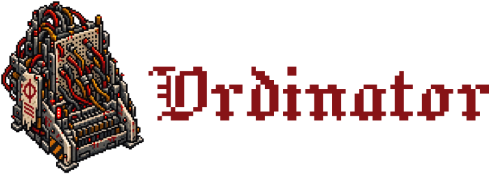

Relational spreadsheets for the agentic stack. Self-hosted. MIT-licensed.

Ordinator is a self-hosted headless relational spreadsheet designed from the ground up for AI agents to author and operate. Documents are declared as YAML files (called **Boards**); a long-lived daemon owns the document and its data in SQLite; a CLI control plane exposes the whole thing for humans and agents alike.

The document is fully defined by the Board file, nowhere else. There is no built-in web UI; the frontend is a separate project, Cerebror, that depends on Ordinator through the same interface agents use.

## Why it exists

If you already run a stack like Servitor for workflow automation, you still need somewhere for the structured data those workflows push and pull: tables, typed columns, formulas. The existing options don't quite fit. Grist is worked through a GUI, with the definition living inside the database where an agent can't see it as text.

Ordinator is an opinionated take: tables, typed columns, and formulas on SQLite, the way a spreadsheet works, but read and written by an agent rather than a GUI.

Because an agent, not a GUI, is what reads and writes the definition, the whole
definition is a text file: the Board, the structure and behavior of a document
together. An agent opens a document and sees every table, column, and formula
in one place. It is diffable, reviewable, and statically checkable. An agent
authors it, a human reviews the diff in a PR, and a compiler turns the reviewed
YAML into a migrated SQLite schema, with a plan/dry-run step before anything
destructive is applied.

## How it is put together

- **The Boards**: one `board.yaml` per document, holding every table, column
  type, and formula. Access rules live in their own `access.yaml`.
- **The daemon** owns the document folder and its single write connection. It
  hosts the compiler, computes formulas over an in-memory model with a
  dependency graph, and serves data continuously.
- **The CLI** is the control plane: how you drive the daemon. You use it to
  inspect a document, plan and apply schema changes, and operate the running
  system. CI, an agent, and a human drive it the same way.

Ordinator is headless, with no UI of its own. The entire frontend is a separate
project, Cerebror, that depends on Ordinator, never the other way around.

## What it deliberately is not

Ordinator does not own workflow. No automations, schedules, branching, or
outbound logic in its own config; those belong to a workflow tool. Formulas are
pure and synchronous, with no I/O. And Ordinator is independent of Servitor: it
sits well next to Servitor in the same stack, but every integration point is a
published standard, useful to someone who has never heard of Servitor.

## Status

Nothing is built yet; the design is being worked out deliberately before code
starts. Open thinking lives in [IDEAS.md](IDEAS.md), settled behavior in
[SPEC.md](SPEC.md), and the plan in [PLAN.md](PLAN.md).
[AGENTS.md](AGENTS.md) describes how context is kept in this repository.
